# 네트워크 기초

노드: 서버, 라우터, 스위치 등 네트워크 장치

링크: 유선 또는 무선

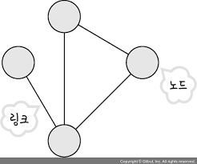

## 처리량과 지연시간

‘좋은 네트워크란?’ = 많은 처리량 + 지연 시간 짧음 + 장애 빈도 적음 + 좋은 보안

### 처리량

링크 내에서 성공적으로 전달된 데이터의 양(단위: bps)

‘많은 트래픽을 처리한다 = 많은 처리량을 가진다.’

트래픽 = 특정 시점에 링크 내에 ‘흐르는’ 데이터의 양

- 트래픽이 많아짐 = 흐르는 데이터가 많아짐
- 처리량이 많아짐 = 처리되는 트래픽이 많아짐

### 지연 시간

요청이 처리되는 시간(어떤 메시지가 두 장치 사이를 왕복하는 데 걸린 시간)

## 네트워크 토폴로지와 병목 현상

### 네트워크 토폴로지

노드, 링크의 연결 형태

- 트리 토폴로지(계층형 토폴로지)
  - 노드의 추가, 삭제 용이
  - 트래픽이 집중될 경우 하위 노드에 영향
- 버스 토폴로지
  - 설치 비용 저렴, 신뢰성 우수, 중앙 통신 회선에 노드 추가/삭제 용이 → 근거리 통신망(LAN) 사용
  - 스푸핑(스위치 기능을 마비시켜 특정 노드에 해당 패킷이 오도록 처리)
- 스타 토폴로지(성형 토폴로지)
  - 노드 추가, 에러 탐지 용이, 패킷 충돌 발생 가능성 적음
  - 중앙 노드에 장애 발생시 전체 네트워크 사용 불가, 고비용
- 링형 토폴로지
  - 노드 수가 증가되어도 네트워크 손실, 충돌 가능성 적음
  - 네트워크 구성 변경 어려움, 회선에 장애가 발생하면 전체 네트워크에 영향
- 메시 토폴로지
  - 한 노드에 장애가 발생해도 네트워크를 계속 사용 가능, 트래픽 분산 처리
  - 노드 추가 어려움, 고비용

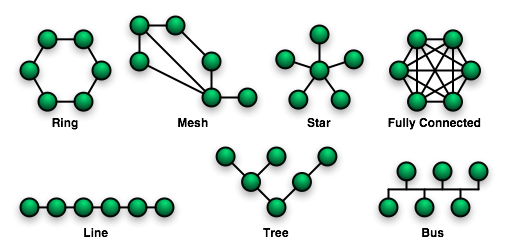

### 병목 현상

‘전체 시스템의 성능이나 용량이 하나의 구성 요소로 인해 제한을 받는 현상’

네트워크 토폴로지 유형을 알아야 병목 현상을 올바르게 해결가능!

## 네트워크 분류

- LAN(Local Area Network)
- MAN(Metropolitan Area Network)
- WAN(Wide Area Network)

## 네트워크 성능 분석 명령어

- ping - 패킷 수신 상태, 도달 시간, 연결 상태 확인(ICMP 프로토콜로 동작)
- netstat - 접속되어 있는 서비스들의 네트워크 상태 표시(주로 포트가 열려 있는지 확인할 때 사용)
- nslookup - DNS 관련된 내용 확인(특정 도메인에 매핑된 IP 확인)
- tracert(traceroute) - 목적지 노드까지 네트워크 경로를 확인할 때 사용

## 네트워크 프로토콜 표준화

네트워크 프로토콜 - 다른 장치들끼리 데이터를 주고받기 위해 설정된 공통된 인터페이스

IEEE802.3 - 유선 LAN 프로토콜

HTTP - 인터넷에서 데이터를 주고받을 수 있는 프로토콜

# TCP/IP 4계층 모델

## 계층 구조

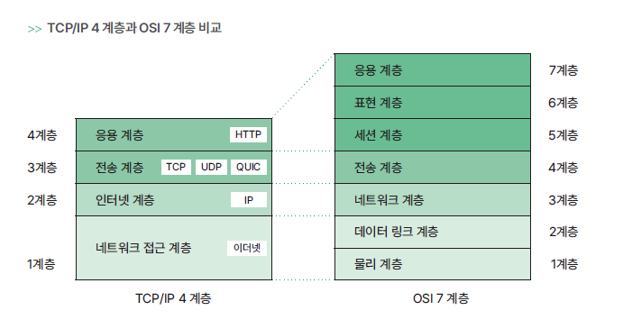

(물데네전세표응…)

### 애플리케이션 계층

서비스를 실질적으로 사람들에게 제공하는 계층

FTP, HTTP, SSH, SMTP, DNS 등의 응용 프로그램이 사용됨

### 전송계층

송신자와 수신자를 연결하는 통신 서비스 제공, 데이터 전달

TCP/UDP

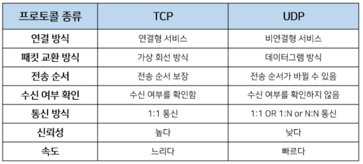

- 가상회선 패킷 교환 방식
  패킷이 가상회선에 따라 순서대로 도착 →전송 순서 보장
  3-way-handshake(SYN →SYN + ACK → ACK)
- 데이터그램 패킷 교환 방식
  패킷이 독립적으로 이동하여 최적의 경로를 선택 →순서 보장하지 않음

### 인터넷 계층

장치로부터 받은 네트워크 패킷을 IP 주소로 지정된 목적지로 전송하는 계층 - 비연결형적

IP, ARP, ICMP

### 링크 계층

실질적으로 데이터를 전달하고 장치 간에 신호를 주고받는 ‘규칙’을 정의하는 계층

물리적 전송 + 동기화, 오류제어, 순서제어

- 유선 LAN(IEEE802.3) - 전이중화 통신
- 무선 LAN(IEEE802.11) - 반이중화 통신
- 이더넷 프레임
  링크 계층은 이더넷 프레임을 통해 전달 받은 데이터의 에러 검출, 캡슐화함

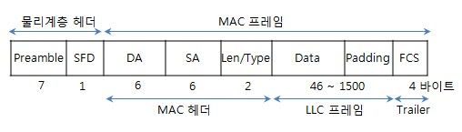

### 계층 간 데이터 송수신 과정

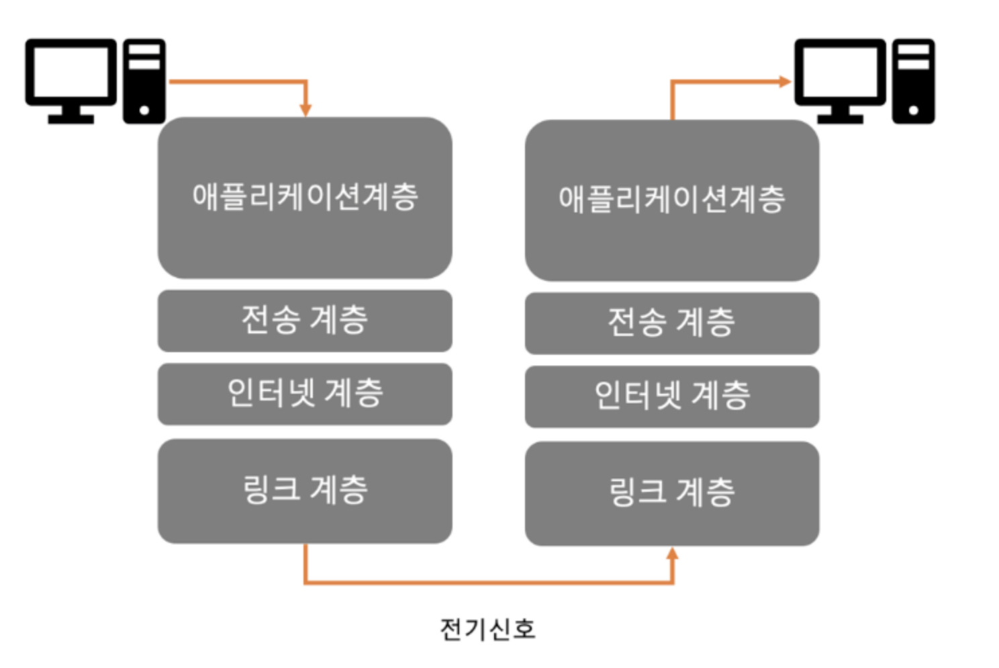

송신자 → 전송요청 → 캡슐화 → 수신측 계층 → 비캡슐화 → 수신자

### PDU(Protocol Data Unit)

각 계층의 프로토콜에서 처리하는 한 덩어리의 데이터 단위

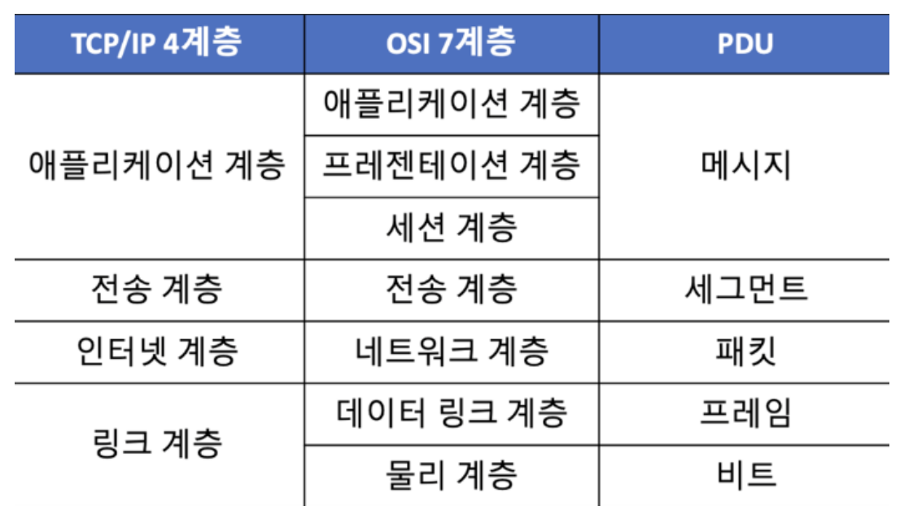

(각 계층마다 명칭이 다름)

# 네트워크 기기

네트워크 기기는 계층별로 처리 범위가 나뉘며 상위 계층을 처리하는 기기는 하위 계층을 처리할 수 있지만 그 반대는 불가함

- 애플리케이션 계층 : L7 스위치
- 인터넷 계층 L3 스위치, 라우터
- 데이터 링크 계층: L2스위치, 브리지
- 물리 계층 : NIC,리피터,AP

## 애플리케이션 계층을 처리하는 기기

스위치: 여러 장비를 연결, 데이터 통신 중재, 목적지가 연결된 포트로만 데이터를 전송하는 통신 네트워크 장비

### L7 스위치

: (로드밸런서), 서버의 부하를 분산하는 기기 → 트래픽 증가 목표

클라이언트로부터 오는 요청들을 뒤쪽의 여러 서버로 나누는 역할

URL, 서버, 캐시, 쿠키들을 기반으로 트래픽을 분산, 불필요한 외부 데이터를 걸러내는 필터링 기능

**L4와 L7의 차이**

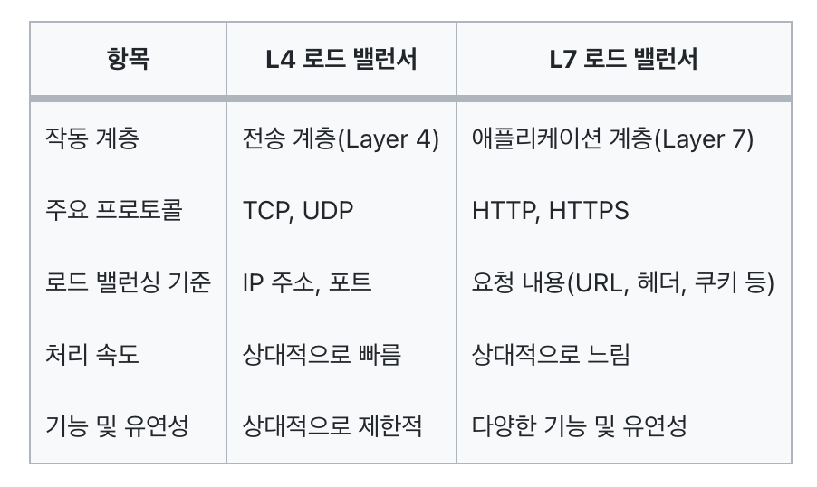

**헬스체크**

전송 주기와 재전송 횟수 등을 설정한 이후 반복적으로 서버에 요청을 보내는 것

→ L4, L7은 헬스 체크를 통해 정상 서버, 비정상 서버를 판별함

**로드밸런서를 이용한 서버 이중화**

로드 밸런서는 2대 이상의 서버를 기반으로 가상 IP를 제공하고 이를 기반으로 안정적인 서비스를 제공함

## 인터넷 계층을 처리하는 기기

### 라우터

: 여러 개의 네트워크를 연결, 분할, 구분시키는 역할

다른 네트워크에 존재하는 장치끼리 서로 데이터를 주고 받을 때 패킷 소모 최소화, 경로 최적화, 최소 경로로 패킷을 포워딩함 → “공유기”

### L3 스위치

: L2 스위치의 기능과 라우팅 기능을 갖춘 장비

| 구분        | L2 스위치       | L3 스위치     |
| ----------- | --------------- | ------------- |
| 참조 테이블 | MAC 주소 테이블 | 라우팅 테이블 |
| 참조 PDU    | 이더넷 프레임   | IP 패킷       |
| 참조 주소   | MAC 주소        | IP 주소       |

## 데이터 링크 계층을 처리하는 기기

### L2 스위치

: 장치들의 MAC 주소를 MAC 주소 테이블을 통해 관리 + 패킷 전송

### 브리지

두 개의 근거리 통신망(LAN)을 상호 접속할 수 있도록 하는 통신망 연결 장치(포트 사이의 다리 역할)

통신망 범위를 확장하고 서로 다른 LAN 등으로 이루어진 ‘하나의’ 통신망을 구축할 때 사용

## 물리 계층을 처리하는 기기

### NIC(Network INterface Card), LAN 카드

: 2대 이상의 컴퓨터 네트워크를 구성하는 데 사용

네트워크와 빠른 속도로 데이터를 송수신할 수 있도록 컴퓨터 내에 설치하는 확장 카드

### 리피터(Repeater)

: 약해진 신호를 증폭하여 다른 쪽으로 전달하는 장치

광케이블 보급된 후로 잘 쓰이지 않음

### AP(Access Point)

: 패킷을 복사하는 기기

AP에 유선 LAN을 연결한 후 다른 장치에서 무선 LAN을 사용하여 무선 네트워크 연결할 수 있음

# IP 주소

컴퓨터간의 통신은 IP주소에서 ARP를 통해 MAC 주소를 찾아 MAC 주소를 기반으로 통신함

## ARP

: IP 주소로부터 MAC 주소를 구하는 IP와 MAC 주소의 다리 역할을 하는 프로토콜

논리적 주소 → (ARP) → 물리적 주소

물리적 주소 → (RARP) → 논리적 주소

## 홉바이홉 통신

: IP 주소를 통해 통신하는 과정

통신 장치에 있는 ‘라우팅 테이블’의 IP를 통해 시작 주소부터 시작하여 다음 IP로 계속해서 이동하는 ‘라우팅’ 과정을 과정을 거쳐 패킷이 최종 목적지까지 도달함

### 라우팅 테이블

라우터에 들어가 있는 목적지 정보들과 그 목적지로 가기 위한 방법이 들어 있는 리스트

### 게이트웨이

서로 다른 통신망, 프로토콜을 사용하는 네트워크 간의 통신을 가능하게 하는 관문 역활의 컴퓨터나 소프트웨어

## IP 주소 체계

- IPv4 vs IPv6

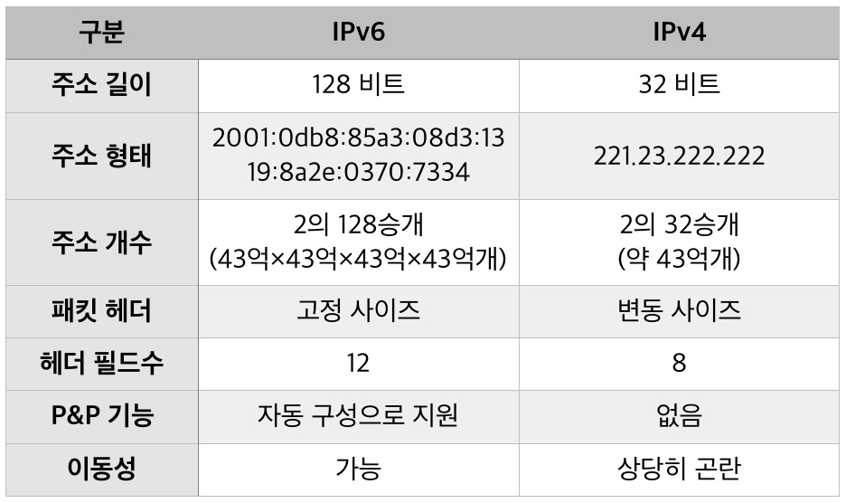

### 클래스 기반 할당 방식

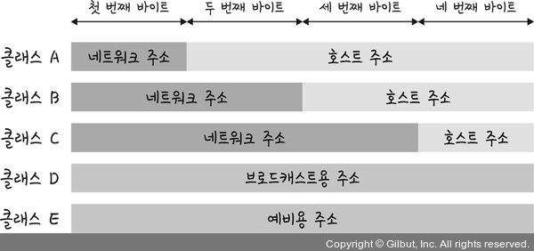

→ 버리는 주소가 많아 DHCP, IPv6, NAT이 나옴

### DHCP(Dynamic Host Configuration Protocol)

: IP주소 및 기타 통신 매개변수를 자동으로 할당하기 위한 네트워크 관리 프로토콜

→ 인터넷에 접속할 때마다 자동으로 IP주소를 할당

### NAT(Network Address Translation)

: 패킷이 라우팅 장치를 통해 전송되는 동안 패킷의 IP 주소 정보를 수정하여 IP 주소를 다른 주소로 매핑하는 방법

→ IPv4의 많은 주소들을 모두 감당하지 못하는 단점을 해결

- 공유기와 NAT
  공유기의 NAT 기능으로 여러 대의 호스트가 공인 IP주소를 사용하여 인터넷에 접속할 수 있음
- NAT를 이용한 보안
  내부 IP주소와 외부 IP주소를 다르게 하여 어느 정도의 보안이 가능
- NAT의 단점
  접속하는 호스트가 많을 경우 접속 속도가 느려짐

## IP 주소를 이용한 위치 정보

: IP 주소는 인터넷에서 사용하는 네트워크 주소이므로 위치를 추적할 수 있음

# HTTP

## HTTP/1.0

기본적으로 한 연결당 하나의 요청을 처리하도록 설계

서버로부터 파일을 가져올때마다 핸드셰이크 과정이 일어남 → RTT 증가

RTT - 패킷이 목적지에 도달하고 나서 다시 출발지로 돌아오기까지 걸리는 시간(패킷 왕복 시간)

→ 이미지 스플리팅, 코드 압축, 이미지 Base64 인코딩을 사용하여 해결

- 이미지 스플리팅
  이미지들이 합쳐져 있는 하나의 이미지를 기반으로 background-position을 통해 2개의 이미지를 표기
- 코드 압축
  개행 문자, 빈칸을 없애서 코드 크기 최소화
- 이미지 Base64
  이미지 파일을 64진법으로 이루어진 문자열로 인코딩하여 이미지에 대한 서버 요청을 생략

## HTTP/1.1

한 번 TCP 초기화를 한 이후 keep-alive 옵션으로 여러 개의 파일을 송수신

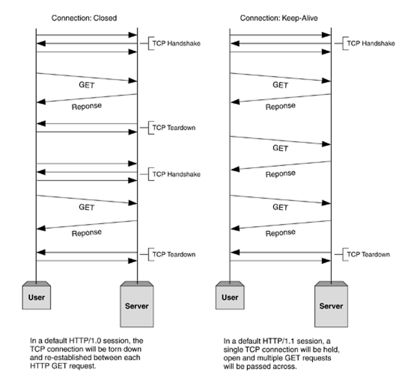

→ 1.1은 핸드셰이크가 한번만 발생함. 리소스에 비례해서 대기 시간이 길어짐

### HTTP/1.1 단점

- HOL Blocking
  : 네트워크에서 같은 큐에 있는 패킷이 그 첫 번째 패킷에 의해 지연될 때 발생하는 성능 저하 현상
  → 리소스가 큰 파일을 받아오면 그 뒤에 있는 리소스들이 대기하게 되어 다운로드가 지연되는 것
- 무거운 헤더 구조
  헤더에 많은 메타데이터가 들어있고 압축되지 않아 무거움

## HTTP/2

멀티플렉싱, 헤더 압축, 서버 푸시, 요청의 우선순위 처리를 지원하는 프로토콜 → 지연시간, 응답시간 줄어듬

### 멀티 플렉싱

: 여러 개의 스트림을 사용하여 송수신

스트림 - 시간이 지남에 따라 사용할 수 있게 되는 일련의 데이터 요소를 가리키는 데이터 흐름

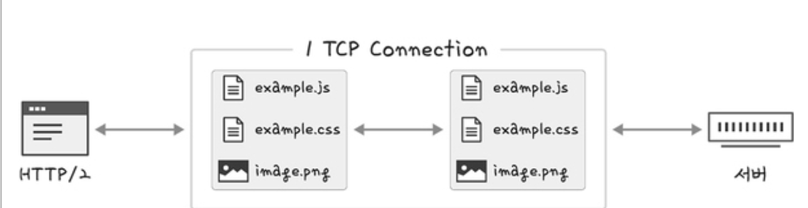

단일 연결을 사용하여 병렬로 여러 요청과 응답을 할 수 있음 → HOL Blocking 문제 해결

### 헤더 압축

허프만 코딩 압축 알고리즘을 사용하는 HPACK 압축 형식으로 헤더를 압축함

- 허프만 코딩
  문자열을 문자 단위로 쪼개 빈도에 따라 비트 개수를 달리하여 비트양을 줄이는 원리

### 서버 푸시

HTTP/1.1에서는 클라이언트가 서버에 요청해야 파일을 다운로드 할 수 있지만 HTTP/2는 클라이언트 요청 없이 서버가 바로 리소스를 푸시할 수 있음

## HTTPS

: 애플리케이션 계층과 전송 계층 사이에 신뢰 계층인 SSL/TLS 계층을 넣은 신뢰 가능한 HTTP 요청 → 통신 암호화

### SSL/TLS

- SSL(Secure Socket Layer)
- TLS(Transport Layer Security Protocol)

전송 계층에서 보안을 제공하는 프로토콜. 클라이언트와 서버가 통신할 때 제3자의 도청,변조를 방지

보안 세션을 기반으로 데이터 암호화

- 보안 세션
  보안이 시작되고 끝나는 동안 유지되는 세션. SSL/TLS는 핸드셰이크를 통해 보안 세션 생성, 상태 정보 공유
- 인증 메커니즘
  CA(Certificate Authorities)에서 발급한 인증서를 기반으로 이루어짐
  ‘공개키’를 클라이언트에 제공하고 사용자가 접속한 서버가 신뢰할 수 있는 서버임을 보장함
- 암호화 알고리즘

  : ECDHE 또는 DHE를 사용

  디퍼-헬만 키 교환 알고리즘

  클라이언트, 서버 : 개인키와 공개키 생성

  서로에게 공개키를 보내고 공개키와 각자의 개인키를 결합하여 공통의 암호인 PSK 생성

  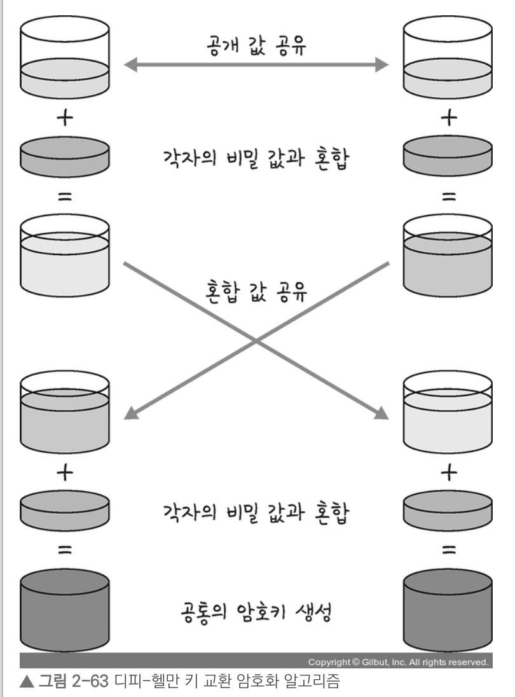

- 해싱 알고리즘
  데이터를 조각으로 만들어 추정하기 힘들게 하는 알고리즘
  - SHA-256 - 전처리된 메시지를 기반으로 해시를 반환
  - SHA-384

### SEO에 도움이 되는 HTTPS

구글 SEO 우선순위에서 HTTP보다 HTTPS가 더 높음

- 캐노니컬 설정
- 메타 설정
- 페이지 속도 개선
- 사이트맵 관리

## HTTP/3

QUIC 계층에서 돌아가며 UDP 기반으로 돌아감

멀티플렉싱 지원, 초기 연결 설정 시 지연 시간 감소

### 초기 연결 시 지연시간 감소

UDP 기반으로 핸드셰이크 과정이 없어 지연시간이 감소함

QUIC는 순방향 오류 수정 메커니즘(FEC)를 적용하여 패킷 손실률을 낮춤

→ 전송한 패킷이 손실된 경우 수신 측에서 에러를 검출하고 수정
