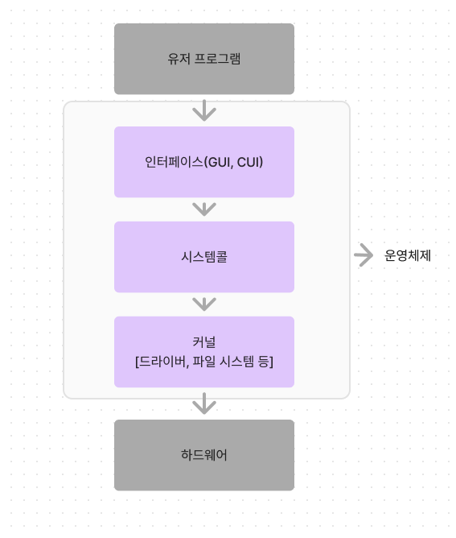

# 운영체제(OS, Operating System)

: 사용자가 컴퓨터를 쉽게 다루게 해주는 인터페이스

→ 다른 응용 프로그램이 유용한 작업을 할 수 있도록 환경을 마련

## 운영체제의 역할과 구조

### 운영체제의 역할

1. CPU 스케줄링과 프로세스 관리
2. 메모리 관리
3. 디스크 파일 관리
4. I/O 디바이스 관리

### 운영체제의 구조

- 인터페이스
  - GUI(Graphic User Interface)
  - CUI(Character User Interface)
- 시스템콜
  : 운영체제가 커널에 접근하기 위한 인터페이스
  → 컴퓨터 자원에 대한 직접 접근 차단, 프로그램 보호
  (유저 모드/커널 모드)
  modebit 0: 커널 모드
  modebit 1: 유저 모드
- 커널
  : 운영체제의 핵심부분, 시스템콜 인터페이스 제공

## 컴퓨터의 요소

### CPU

: Central Processing Unit(중앙 처리 장치)

- 제어 장치 - 입출력 간 통신 제어, 명령어 해석, 데이터 처리 순서 결정
- 레지스터 - 임시기억장치
- 산술논리연산장치 - 산술 연산, 논리 연산을 계산하는 디지털 회로

연산 처리 과정

1. 제어 장치가 계산할 값을 메모리, 레지스터에 로드
2. 레지스터에 있는 값을 산술논리연산장치가 계산
3. 계산된 값을 ‘레지스터에서 메모리로’ 계산한 값을 저장

인터럽트

: 어떤 신호가 들어왔을 때 CPU를 잠깐 정지시키는 것

IO 디바이스로 인한 인터럽트 → 하드웨어 인터럽트

프로세스 오류 → 소프트웨어 인터럽트

### DMA 컨트롤러

: I/O 디바이스가 메모리에 직접 접근할 수 있도록 하는 하드웨어 장치

→ CPU부하를 막아주는 역할

### 메모리

: 데이터, 상태, 명령어 등을 기록하는 장치

CPU → 계산 담당

메모리 → 기억 담당

### 타이머

: 특정 프로그램에 시간 제한을 다는 역할

### 디바이스 컨트롤러

: IO 디바이스들의 작은 CPU

로컬 버퍼 - 각 디바이스에서 데이터를 임시로 저장하기 위한 작은 메모리

## 메모리

CPU는 ‘메모리’에 있는 프로그램의 명령어들을 실행함

### 메모리 계층

- 레지스터 - CPU 안에 있는 작은 메모리
- 캐시 - L1,L2 캐시
- 주기억장치 - RAM
- 보조기억장치 - HDD, SSD

계층이 있는 이유 - 경제성과 캐시

### 캐시

: 데이터를 미리 복사해 놓는 임시 저장소

→ 무언가를 다시 계산하는 시간을 절약

계층 간의 속도 차이를 해결하기 위해 캐싱 계층을 둬서 해결함

[지역성의 원리] - 캐싱 계층 외에 직접 캐시를 설정할 때

- 시간 지역성 - 최근 사용한 데이터에 다시 접근하려는 특성
- 공간 지역성 - 최근 접근한 데이터를 이루고 있는 공간이나 가까운 공간에 접근하는 특성

### 캐시히트와 캐시미스

캐시히트 - 캐시에서 원하는 데이터를 찾음(CPU 내부 버스 기반 → 빠름)

캐시미스 - 해당 데이터가 캐시에 없어 주 메모리로 가서 데이터를 찾아오는 것( 시스템 버스 기반 → 느림)

캐시매핑 - 캐시가 히트되기 위해 매핑하는 방법

- 직접 매핑
- 연관 매핑
- 집합 연관 매핑

[웹 브라우저의 캐시]

쿠키 - 만료기한이 있는 키-값 저장소

로컬 스토리지 - 만료기한이 없는 키-값 저장소(웹 브라우저를 닫아도 유지)

세션 스토리지 - 만료기한이 없는 키-값 저장소(탭 단위로 스토리지 생성, 탭을 닫으면 데이터 삭제)

## 메모리 관리

### 가상 메모리

: 메모리 관리 기법 중 하나. 컴퓨터가 실제로 이용 가능한 메모리 자원을 추상화하여 사용자들에게 매우 큰 메모리로 보이게 만드든 것

가상 메모리는 가상 주소와 실제 주소가 매핑되어 있음 → ‘페이지 테이블’로 관리

가상 주소는 메모리관리장치(MMU)에 의해 실제 주소로 변환됨

[스와핑과 페이지 폴트]

페이지 폴트 - 프로세스의 주소 공간에는 존재하지만 컴퓨터의 RAM에는 없는 데이터에 접근했을 경우 발생

스와핑 - 메모리에서 당장 사용하지 않는 영역을 하드디스크로 옮기고 하드디스크의 일부분을 마치 메모리처럼 불러와 쓰는 것 → 페이지 폴트가 일어나지 않은 것처럼 함

1. 어떤 명령어가 가상 주소에 접근했지만 해당 페이지가 없어 트랩 발생 → 운영체제에 알림
2. 운영체제는 실제 디스크로부터 사용하지 않은 프레임을 찾음
3. 해당 프레임을 실제 메모리에 가져와서 특정 페이지와 교체(스와핑, 페이지 교체 알고리즘)
4. 페이지 테이블 갱신 후 해당 명령어 다시 시작

### 스레싱

: 메모리의 페이지 폴트율이 높은 것 → 심각한 성능 저하

너무 많은 프로세스 → 스와핑 증가 → 페이지 폴트 발생 → CPU 이용률 낮아짐

→ 가용성을 더 높이기 위해 더 많은 프로세스 올라감 → 악순환 반복

[해결법]

- 메모리 증가
- HDD → SSD
- 작업 세트
  지역성을 통해 결정된 페이지 집합을 만들어서 미리 메모리에 로드하는 것
- PFF(Page Fault Frequency)
  페이지 폴트 빈도를 조절하는 방법으로 상한선과 하한선을 만드는 방법

### 메모리 할당

: 메모리에 프로그램을 할당할 때는 시작 메로리 위치, 메모리의 할당 크기를 기반으로 할당함

- 연속 할당
  메모리에 ‘연속적으로’ 공간을 할당하는 것
  - 고정 분할 방식 - 메모리를 미리 나누어 관리, 내부 단편화 발생
  - 가변 분할 방식 - 매 시점 프로그램의 크기에 맞게 메모리를 분할하여 사용, 외부 단편화 발생
    (최초적합, 최적적합, 최악적합)
    Hole: 100 /500 / 600 / 300 / 200 KB
    프로세스: 212 KB
    최초 - 500, 최적 - 300, 최악 - 600
- 불연속 할당
  메모리를 동일한 크기의 페이지로 나누고 프로그램마다 페이지 테이블을 두어 이를 통해 메모리에 프로그램을 할당하는 것
  - 페이징 - 동일한 크기의 페이지 단위로 나누어 프로세스를 할당
  - 세그멘테이션 - 의미 단위인 세그먼트로 나누어 할당(공유, 보안 Good / 홀 크기 불균일)
  - 페이지드 세그멘테이션
    세그먼트로 나누어 할당하고 동일한 크기의 페이지 단위로 나눔

### 페이지 교체 알고리즘

스와핑이 많이 일어나지 않도록 하기 위한 알고리즘

- 오프라인 알고리즘
  먼 미래에 참조되는 페이지와 현재 할당하는 페이지를 바꾸는 방법
  → Best way but impossible(상한기준을 제공하는 용도)
- FIFO(First In First Out) - 선입선출
- LRU(Least Recently Used) - 참조가 가장 오래된 페이지를 바꿈
- NUR(Not Used Recently) - LRU에서 발전, clock 알고리즘
- LFU(Least Frequently Used) - 가장 참조 횟수가 적은 페이지 교체

## 프로세스와 스레드

프로세스 - 컴퓨터에서 실행되고 있는 프로그램( = CPU 스케줄링의 대상이 되는 작업,task)

스레드 - 프로세스 내 작업의 흐름

프로그램이 메모리에 올라감 — 인스턴스화 —> 프로세스

운영체제의 CPU스케줄러에 따라 CPU가 프로세스를 실행

### 프로세스와 컴파일 과정

프로세스 - 프로그램이 메모리에 올라가 인스턴스화된 것

프로그램(chrome.ext, 실행파일) — 두번 클릭하면 —> 구글 크롬 프로세스

[컴파일]

: 사람이 이해할 수 있는 소스코드를 컴퓨터가 이해할 수 있는 기계어로 번역하는 것

과정

1. 전처리 - 주석 제거, 헤더 파일 병합
2. 컴파일러 - 오류 처리, 코드 최적화, 어셈블리어로 변환
3. 어셈블러 - 목적 코드로 변환
4. 링커 - 프로그램 내에 있는 라이브러리 함수 또는 다른 파일들과 목적 코드를 결합하여 실행파일을 만듬

### 프로세스의 상태

- 생성 상태
  프로세스가 생성된 상태
  fork(), exec() 함수를 통해 생성
- 대기 상태
  메모리 공간이 충분 → 메모리 할당, 충분 X → 대기
  CPU 스케줄러부터 CPU 소유권이 넘어오기를 기다리는 상태
- 대기 중단 상태
  메모리 부족으로 일시 중단된 상태
- 실행 상태
  CPU 소유권과 메모리를 할당받고 인스트럭션을 수행 중인 상태(CPU burst가 일어남)
- 중단 상태
  어떤 이벤트가 발생한 이후 기다리며 프로세스가 차단된 상태
  I/O디바이스에 의한 인터럽트로 자주 발생
- 일시 중단 상태
  대기 중단과 유사. 메모리 부족으로 일시 중단
- 종료 상태
  메모리와, CPU 소유권을 모두 놓고 가는 상태

## 프로세스의 메모리 구조

운영체제는 프로세스에 적절한 메모리를 할당하는데 다음 구조를 기반으로 할당함

- 스택과 힙
  동적할당(런타임 단계에서 메모리를 할당 받는 것)
  스택 - 함수가 호출될 때마다 특정 정보가 스택에 계속 저장
  힙 - 동적으로 할당되는 변수들을 담음
- 데이터 영역과 코드 영역
  정적 할당(컴파일 단계에서 메모리를 할당)
  - 데이터 영역
    - BSS segment
    - Data segment
    - code/text segment

### PCB(Process Control Block)

프로세스에 대한 메타데이터를 저장한 ‘데이터’, 프로세스 제어 블록

프로세스가 생성 → 운영체제는 해당 PCB를 생성

PCB 구조

- 프로세스 스케줄링 상태
- 프로세스 ID
- 프로세스 권한
- 프로그램 카운터
- CPU 레지스터
- CPU 스케줄링 정보
- 계정 정보
- I/O 상태 정보

컨텍스트 스위칭

: PCB를 기반으로 프로세스의 상태를 저장하고 로드시키는 과정

한 프로세스에 할당된 시간이 끝나거나 인터럽트에 의해 발생

### 멀티프로세싱

: 여러 개의 프로세스를 통해 동시에 두 가지 이상의 일을 수행할 수 있는 것

→ 병렬 처리, 신뢰성 높음

웹 브라우저의 멀티프로세스 구조

- 브라우저 프로세스
- 렌더러 프로세스
- 플러그인 프로세스
- GPU 프로세스

IPC(Inter Process Communication)

: 프로세스끼리 데이터를 주고 받고 공유 데이터를 관리하는 메커니즘

멀티프로세스는 IPC가 가능함

클라이언트 → 데이터 요청 → 서버 → 데이터 응답

- 공유 메모리 - 여러 프로세스에 동일한 메모리 블록에 대한 접근 권한이 부여되어 프로세스가 서로 통신할 수 있도록 공유 메모리를 생성해서 통신하는 것
- 파일 - 디스크에 저장된 데이터 또는 파일 서버에서 제공한 데이터 → 이를 기반으로 프로세스 간 통신
- 소켓 - 동일한 컴퓨터의 다른 프로세스나 네트워크의 다른 컴퓨터로 네트워크 인터페이스로 전송하는 데이터(TCP, UDP)
- 익명 파이프 - 프로세스 간 FIFO 방식으로 읽히는 임시 공간인 파이프를 기반으로 데이터 공유(단방향)
- 명명된 파이프 - 파이프 서버와 하나 이상의 파이프 클라이언트 간의 통신을 위한 명명된 단방향, 양방향 파이프
- 메세지 큐 - 메시지를 큐 데이터 구조 형태로 관리하는 것

→ 이들 모두 스레드보다는 속도가 떨어짐

## 스레드와 멀티 스레딩

### 스레드

: 프로세스의 실행 가능한 가장 작은 단위. 프로세스는 여러 스레드를 가질 수 있음

### 멀티 스레딩

: 프로세스 내 작업을 여러 개의 스레드로 처리하는 기법. 스레드끼리 서로 자원을 공유하여 효율성 높음

## 공유 자원과 임계 영역

### 공유 자원

시스템 안에서 각 프로세스, 스레드가 함께 접근할 수 있는 자원(모니터, 프린터, 데이터)이나 변수

공유 자원을 여러 프로세스가 동시에 읽거나 쓰는 상황 → 경쟁 상태

### 임계 영역

: 둘 이상의 프로세스, 스레드가 공유 자원에 접근할 때 순서 등의 이류로 결과가 달라지는 코드 영역

→ 이를 해결하기 위해 뮤텍스, 세마포어, 모니터 방법이 있음

- 뮤텍스
  프로세스나 스레드가 공유 자원을 잠금 설정하고 사용한 후에 잠금 해제하는 객체
  잠긴 코드는 다른 프로세스나 스레드가 접근할 수 없음
- 세마포어
  일반화된 뮤텍스.
  프로세스나 스레드가 공유 자원에 접근하면 세마포어에서 자신의 차례가 올 때까지 기다리며(wait함수) 공유 자원을 해제하면 다음 프로세스로 순서를 넘겨줌(signal함수)
- 모니터
  둘 이상의 스레드나 프로세스가 공유 자원에 안전하게 접근할 수 있도록 공유 자원을 숨기고 해당 접근에 대해 인터페이스만 제공

### 교착 상태

: 두 개 이상의 프로세스들이 서로가 가진 자원을 기다리며 중단된 상태

원인

- 상호 배제
- 점유 대기
- 비선점
- 환형 대기

해결 방법

1. 조건이 성립되지 않도록 설계
2. 은행원 알고리즘
3. 교착 상태 발생시 사이클이 있는지 찾아보고 관련된 프로세스를 한 개씩 지움
4. 작업 종료(처리 비용 줄이기)

## CPU 스케줄링 알고리즘

CPU 스케줄러는 CPU 스케줄링 알고리즘에 따라 프로세스에서 해야 할 일을 스레드 단위로 CPU에 할당

→ CPU 이용률 높게, 주어진 시간에 많은 일, 준비 큐의 프로세스는 적게, 응답시간은 짧게를 목표

### 비선점형 방식

프로세스가 스스로 CPU 소유권을 포기하는 방식. 강제로 프로세스를 중지하지 않음 → 컨텍스트 스위칭으로 인한 부하가 적음

- FCFS(First Come, First Served) - 길게 수행되는 프로세스 → 준비 큐에서 오래 기다리는 현상(convoy effect)
- SJF(Shortest Job First) - 긴 시간을 가진 프로세스가 실행되지 않는 현상(starvation), 평균 대기 시간 가장 짧음
- 우선순위 - starvation현상을 보완하기 위해 오래된 작업일 수록 우선순위를 높임

### 선점형 방식

사용하고 있는 프로세스를 중단하고 강제로 다른 프로세스에 CPU 소유권을 할당하는 방식

- RR(Round Robin) - 각 프로세스는 동일한 할당 시간을 주고 그 시간 안에 끝나지 않으면 다시 준비큐의 뒤로 가는 방식, 로드 밸런서의 트래픽 분산 알고리즘
- SRF(Shortest Remaining Time First) - SJF와 달리 중간에 더 짧은 작업이 들어오면 해당 프로세스를 먼저 수행
- 다단계 큐 - 우선순위에 따른 큐를 여러 개 사용, 큐마다 다른 스케줄링 알고리즘을 적용
