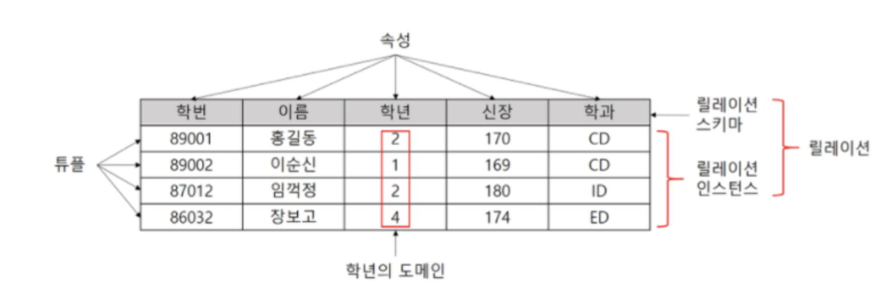
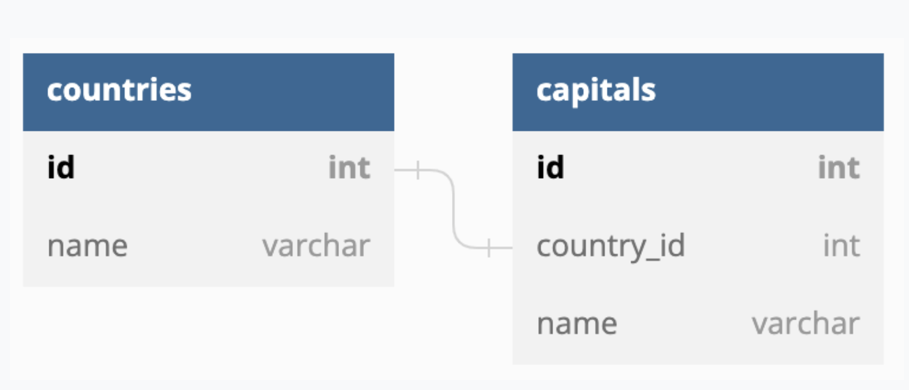
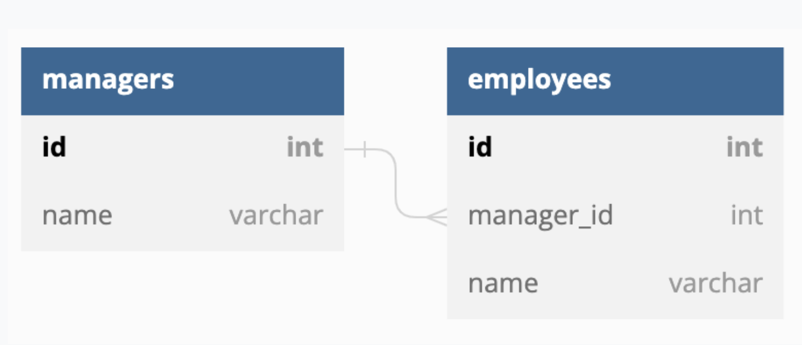
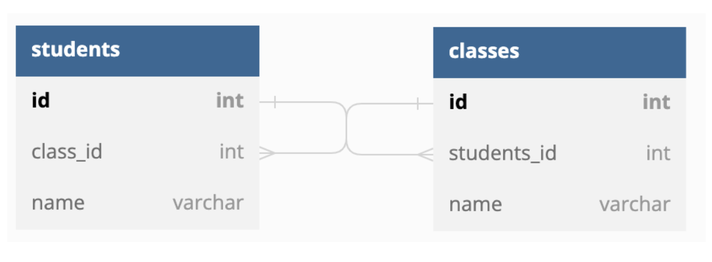
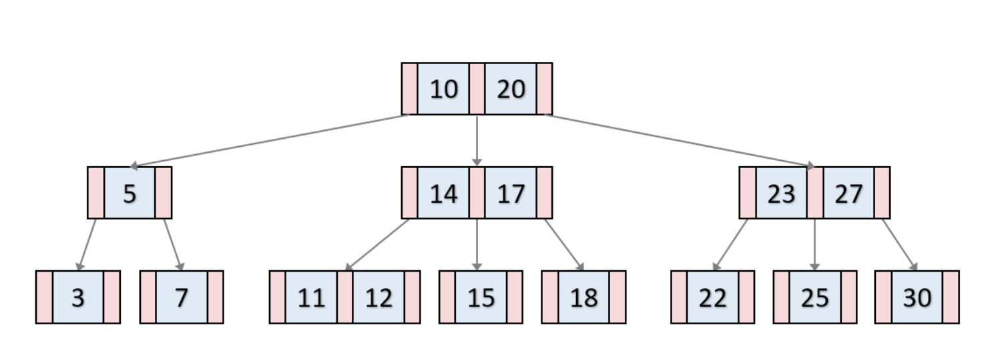
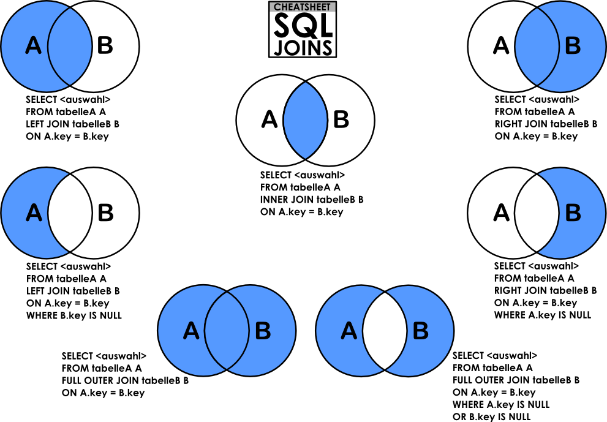

# 데이터베이스의 기본

데이터베이스(DB): 일정한 규칙, 규약을 통해 구조화되어 저장되는 데이터의 모음

DMBS(DataBase Management System): 데이터베이스를 제어, 관리하는 통합 시스템

### 엔티티(entity)

: 사람, 장소, 물건, 사건, 개념 등 여러 개의 속성을 지닌 명사

→ 학생(엔티티) - 학년, 이름, 학교 등의 속성을 가짐

약한 엔티티(방) - 무언가에 종속적, 혼자서는 존재하지 못함

강한 엔티티(건물) - 혼자서도 존재할 수 있음

### 릴레이션(relation)

: 데이터베이스에서 정보를 구분하여 저장하는 기본 단위

관계형 데이터베이스 - 테이블

NoSQL 데이터베이스 - 컬렉션

### 속성(attribute)

: 구체적이며 고유한 이름을 갖는 정보

‘차’이라는 엔티티의 속성 - 바퀴, 색, 차종 등

### 도메인(domain)

: 속성들의 집합

성별(도메인) - 남,녀(속성)

### 필드와 레코드(field and record)

열단위의 데이터 = 필드

행단위의 데이터 = 레코드(튜플)

필드 타입

- 숫자 타입
- 날짜 타입
- 문자 타입

### 관계

데이터베이스에서 테이블은 서로 관계가 정의되어 있음

- 1:1 관계 - 하나의 레코드가 다른 테이블의 레코드 한 개와 연결된 경우

    국가 - 수도

- 1:N 관계 - 하나의 레코드가 서로 다른 여러 개의 레코드와 연결된 경우
  
  관리자 - 직원들
- N:M 관계 - 여러 개의 레코드가 다른 테이블의 여러 개의 레코드와 관계가 있는 경우

    학생 - 강의

### 키

: 테이블 간의 관계를 명확히 하고 테이블 자체의 인덱스를 위한 장치

- 후보키(Candidate key)
  기본키가 될 수 있는 후보. 유일성과 최소성을 만족
- 기본키(Primary Key)
  유일성과 최소성을 만족하는 키
  유일성 - 하나의 키값으로 튜플을 유일하게 식별할 수 있는 성질
  최소성 - 키를 구성하는 속성들 중 꼭 필요한 최소한의 속성들로만 키를 구성하는 성질
- 외래키(Foreign Key)
  다른 테이블의 기본키를 그대로 참조하는 값
- 대체키(Alternate Key)
  후보키가 두 개 이상일 경우 어느 하나를 기본키로 지정하고 남은 후보키
- 슈퍼키(Super Key)
  유일성만 갖춘 키

## ERD와 정규화 과정

ERD(Entity Relationship Diagram)

: 릴레이션 간의 관계들을 정의한 것. DB의 뼈대 역할

### ERD의 중요성

ERD - 시스템의 요구 사항 기반으로 작성

데이터베이스 - ERD를 기반으로 구축

구축 이후에도 디버깅, 비즈니스 프로세스 재설계가 필요한 경우 설계도 역할

- 관계형 구조 데이터를 구성하는데 유용
- 비정형 데이터는 충분히 표현 못함

### 정규화 과정

: 릴레이션을 여러 개로 분리하는 과정

→ 데이터베이스 이상 현상 해결, 저장 공간 효율적 사용

**도부이결다조**

- 1NF : 모든 **도**메인이 원자 값으로만 구성
- 2NF : 기본키가 아닌 속성이 기본키에 대한 완전 함수적 종속을 만족, **부**분적 함수 종속을 제거한 정규형
- 3NF : 기본키가 아닌 모든 속성이 기본키에 대해 **이**행적 함수 종속 관계를 만족하지 않는 정규형
- BCNF : 모든 **결**정자가 후보키인 정규형, 종속성 보존X
- 4NF : **다**치 종속이 성립하는 경우, R의 모든 속성이 A에 함수적 종속 관계를 만족
- 5NF : 모든 **조**인 종속이 R의 후보키를 통해서만 성립되는 정규형

→ 정규화 과정을 거친다고 무조건 성능이 좋아지는 건 아님. 조인을 해야 하는 경우 오히려 느려질 수도 있음

## 트랜잭션과 무결성

### 트랜잭션

: 하나의 논리적 기능을 수행하기 위한 작업의 단위

데이터베이스 상태를 변화시키기 위해 수행하는 작업의 단위인데 SELECT, INSERT 이런 한 문장이 아니라 여러 문장들을 합친 작업 단위가 하나의 트랜잭션이 됩니다. (작업 단위는 사람이 정합니다.)

**ACID**

- 원자성(Atomic)
  : 트랜잭션 연산은 DB에 보두 반영되든지 아니면 전혀 반영되지 않아야 함
  커밋 - 어떤 쿼리가 성공적으로 처리되었다고 확정하는 명령어
  커밋이 수행됨 = 하나의 트랜잭션이 성공적으로 수행됨
  롤백 - 트랜잭션으로 처리한 과정이 일어나기 전으로 돌리는(취소하는) 작업
- 일관성(Consistency)
  : 트랜잭션이 실행을 성공적으로 완료하면 언제나 일관성 있는 DB상태로 변환함
- 격리성(Isolation)
  : 트랜잭션 실행 중 다른 트랜잭션은 접근이 불가함
  격리 수준에 따라 발생하는 현상 - 팬텀 리드, 반복 가능하지 않은 조회, 더티 리드
  격리 수준 - SERIALIZABLE, REPEATABLE_READ, READ_COMMITED, READ_UNCOMMITED
- 지속성(Durability)
  : 성공적으로 수행된 트랜잭션은 영구적으로 반영됨
  시스템 장애가 발생해도 복구하는 회복 기능
  체크섬 - 오류 정정을 통해 송신된 자료의 무결성 보호
  저널링 - 변경 사항을 반영하기 전에 로깅하는 것

### 무결성

: 데이터의 정확성, 일관성, 유효성을 유지하는 것.

→ 무결성이 유지되어야 신뢰가 생김

**개체 무결성 (Entity Integrity)**

: 기본 테이블의 기본키를 구성하는 어떤 속성도 Null 값이나 중복값을 가질 수 없다.(빈 값 불가)

**참조 무결성 (Referential Integrity)**

: 외래키 값은 Null 이거나 참조 릴레이션의 기본키 값과 동일해야한다. 즉, 릴레이션은 참조할 수 없는 외래키 값을 가질 수 없다.

**고유 (Unique) 무결성**

: 릴레이션의 특정 속성에 대해 각 튜플이 갖는 속성값들이 서로 달라야한다. (모든 속성 값은 고유한 값을 가짐)

**NULL 무결성**

: 릴레이션의 특정 속성 값이 NULL 이 될 수 없도록 한다.

## 데이터베이스의 종류

### 관계형 데이터베이스(RDBMS)

: 표 형식 데이터를 저장하는 형태의 데이터베이스. SQL 언어를 사용

- MySQL
- PostgreSQL
- 오라클

### NoSQL(Not only SQL)

: SQL을 사용하지 않는 데이터베이스

- MongoDB - JSON
- redis

## 인덱스

### 인덱스의 필요성

: 인덱스는 데이터를 빠르게 찾을 수 있는 하나의 장치 → 책의 찾아보기

### B-트리

인덱스는 보통 B-트리 자료 구조로 이루어져 있음

루트 노드 → 브랜치 노드 → 리프 노드

[인덱스가 효율적인 이유와 대수확장성]

→ 효율적인 단계를 거쳐 모든 요소에 접근할 수 있는 트리 구조 + 트리 깊이의 대수확장성

대수확장성 - 트리 깊이가 리프 노드 수에 비해 매우 느리게 성장하는 것

트리 깊이의 따른 인덱스 항목의 수 = 4ⁿ

### 인덱스 만드는 방법

- MySQL
  primary key 옵션으로 기본키 만들면 클러스터형 인덱스 생성
  기본키로 만들지 않고 unique not null 옵션을 붙이면 클러스터형 인덱스
  create index… 명령어를 기반으로 세컨더리 인덱스
- MongoDB
  도큐먼트를 만들면 자동으로 ObjectID 형성
  해당 키가 기본키로 설정
  세컨더리 키를 부가적으로 설정하면 기본키와 세컨더리키를 같이 쓰는 복합 인덱스

### 인덱스 최적화 기법

1. 인덱스는 비용이다
2. 항상 테스팅하라
3. 복합 인덱스는 같음, 정렬, 다중 값, 카디널리티 순이다

## 조인의 종류

조인(join)

: 두 개 이상의 테이블을 묶어서 하나의 결과물을 만드는 것

MySQL - JOIN

MongoDB - lookup(몽고DB는 조인 연산 성능이 좋지 않으므로 사용시 주의할 것)

[조인의 종류]

- 내부조인 - 두 테이블 간에 교집합
- 왼쪽조인 - 테이블 B의 일치하는 부분의 레코드와 함께 테이블 A를 기준으로 완전한 레코드 집합을 생성
- 오른쪽조인 - 테이블 A의 일치하는 부분의 레코드와 함께 테이블 B를 기준으로 완전한 레코드 집합을 생성
- 합집합조인 - 양쪽 테이블에서 일치하는 레코드와 함께 테이블 A와 테이블B의 모든 레코드 집합을 생성

## 조인의 원리

: 조인은 조인의 원리를 기반으로 조인 작업이 이루어짐

### 중첩 루프 조인(NLJ, Nested Loop Join)

- for문과 같은 원리로 조건에 맞는 조인을 하는 방법
- 랜덤 접근에 대한 비용 증가 → 대용량 테이블은 적합하지 않음

### 정렬 병합 조인

: 각각의 테이블을 조인할 필드 기준으로 정렬하고 정렬이 끝난 이후에 조인 작업을 수행하는 조인

### 해시 조인

: 해시 테이블을 기반으로 조인하는 방법

두 개의 테이블을 조인하는 경우 하나의 테이블이 메모리에 온전히 들어간다면 NLF보다 효율적

MySQL

- 빌드 단계
  : 입력 테이블 중 하나를 기반으로 메모리 내 해시 테이블을 빌드하는 단계
  두 테이블 중 바이트가 더 작은 테이블 기반으로 빌드, 조인에 사용되는 필드가 키로 사용
- 프로브 단계
  : 레코드를 읽기 시작, 해시 테이블을 기반으로 일치하는 레코드를 찾아 결과값으로 반환
