### 자료구조란?

효율적으로 데이터를 관리하고 수정, 삭제, 탐색, 저장할 수 있는 데이터 집합

→ 데이터를 정리하는 방식(배열, 스택, 큐, 트리 등)

# 복잡도

알고리즘의 성능, 효율을 나타내는 척도

## 시간 복잡도

: 입력 크기에 대해 어떠한 알고리즘이 실행되는 데 걸리는 시간

→ 주요 로직의 반복 횟수를 중점으로 측정

### 빅오 표기법

: 입력 범위 n을 기준으로 로직이 몇 번 반복되는지 나타내는 것

- 최악의 경우를 기준
- 입력 크기가 무한대로 접근할 때의 증가율에 초점
- 상수항과 계수는 무시

3n^2 + 10n + 20 → n^2

(점근식 표기법)

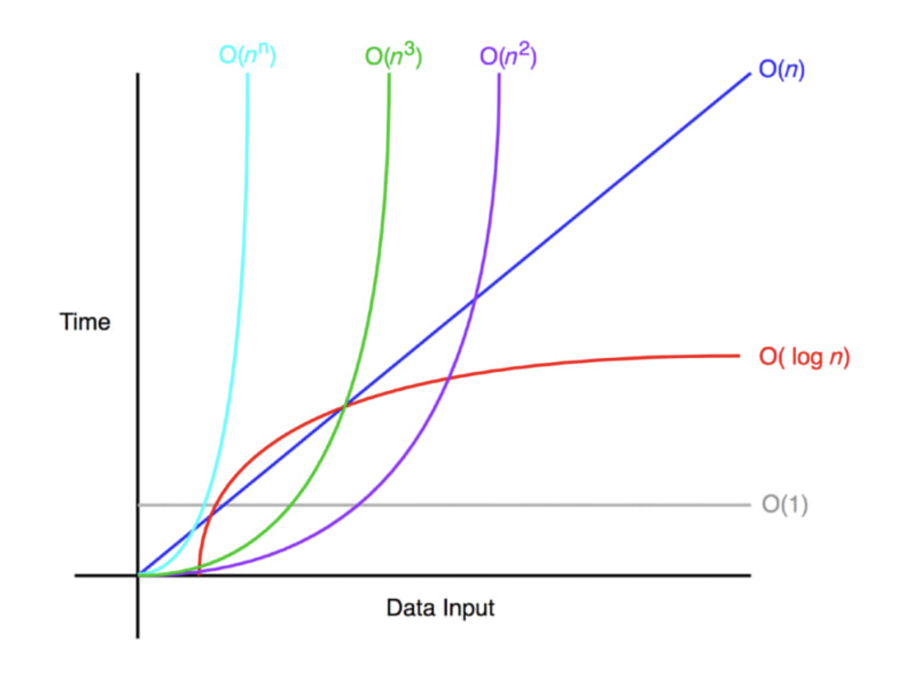

→ O(1)을 지향해야 함!

Quiz!

```jsx
function some(n) {
  for (let i = 0; i < 1000 * n; i++) {
    for (let j = 0; j < 20 * n; j++) {
      console.log(i, j);
    }
  }
}
```

- 정답
  내부 반복문은 `20*n`번 실행되므로 O(n) 복잡도를 가집니다.
  바깥쪽 반복문은 `1000*n`번 실행되므로 O(n) 복잡도를 가집니다.
  내부 반복문이 바깥쪽 반복문 안에 있으므로, 두 복잡도를 곱해야 합니다.
  O(1000*n) * O(20*n) = O(20000*n^2) = O(n^2)
  상수는 빅오 표기법에서 무시되므로, 최종적인 시간 복잡도는 O(n^2)입니다.

## 공간 복잡도

: 프로그램을 실행시켰을 때 필요로 하는 자원 공간의 양

→ 메모리 할당량

# 선형 자료 구조

: 요소가 일렬로 나열되어 있는 자료 구조

## 연결 리스트

: 데이터를 감싼 노드를 포인터로 연결해서 공간적인 효율성을 극대화시킨 자료 구조

삽입,삭제 = O(1), 탐색 = O(n)

- 싱글 연결 리스트

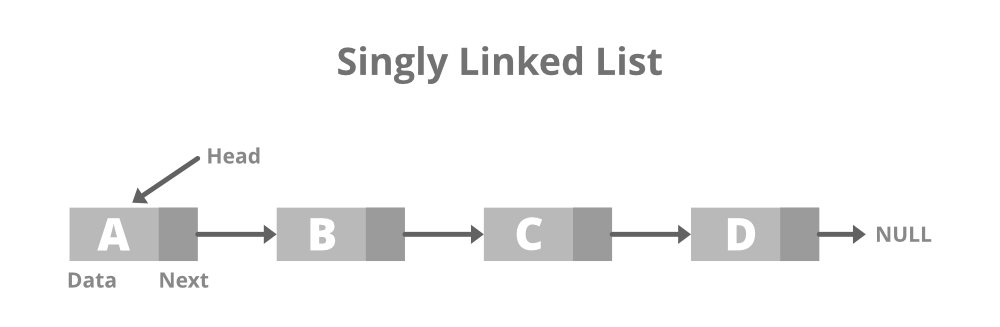

- 이중 연결 리스트

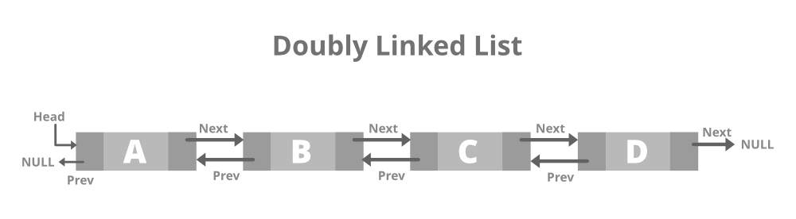

- 원형 이중 연결 리스트

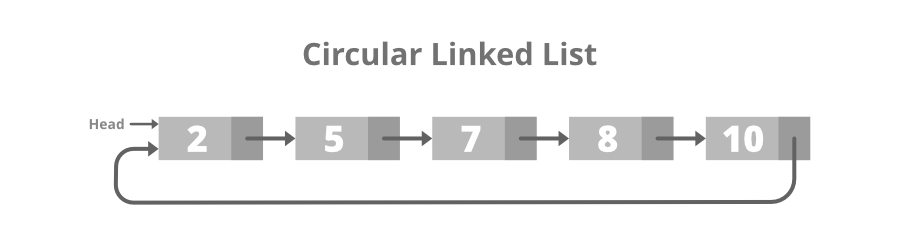

### 배열

: 같은 타입의 변수들로 이루어져 있고, 크기가 정해져 있으며, 인접한 메모리 위치에 있는 데이터들의 집합

→ 중복 허용, 순서

삽입, 삭제 = O(n), 탐색 = O(1)

**랜덤 접근과 순차적 접근**

- 랜덤 접근
  동일한 시간에 배열과 같은 순차적인 데이터가 있을 때 임의의 인덱스에 해닥하는 데이터에 접근할 수 있는 기능(직접 접근)
- 순차적 접근
  데이터를 저장된 순서대로 검색

**배열과 연결 리스트 비교**

배열 - 랜덤 접근 가능 → O(1)

랜덤 접근 불가능 →O(n)

## 벡터

: 동적으로 요소를 할당할 수 있는 동적 배열

→ 중복 허용, 순서, 랜덤 접근 가능

탐색 = O(1)

맨 뒤 요소 삽입 삭제(push_back) = O(1)

맨 뒤가 아닌 요소 삽입 삭제 = O(n)

## 스택

: 가장 마지막으로 들어간 데이터가 가장 첫 번째로 나오는 성질(LIFO)을 가진 자료구조

재귀적인 함수, 알고리즘, 웹 브라우저 방문 기록에 사용

삽입 삭제 = O(1)

탐색 = O(n)

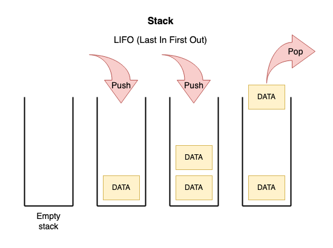

## 큐

: 먼저 넣은 데이터가 먼저 나오는 성질(FIFO)을 가진 자료 구조 → 스택과 반대

CPU 작업을 기다리는 프로세스, 스레드 행렬 또는 네트워크 접속을 기다리는 행렬, 너비 우선 탐색, 캐시 등에 사용

삽입 삭제 = O(1)

탐색 = O(n)

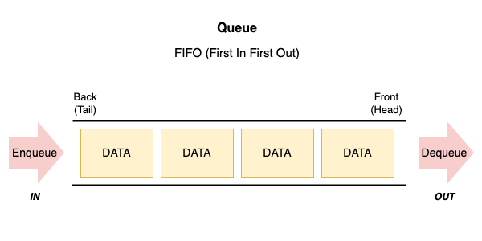

# 비선형 자료 구조

: 일렬로 나열하지 않고 자료 순서나 관계가 복잡한 구조

## 그래프

: 정점과 간선으로 이루어지 자료 구조


정점(node, vertex) - 데이터가 저장되는 공간

간선(edge) - 노드간의 관계

## 트리

정점과 간선으로 이루어져 있고, 트리 구조로 배열된 일종의 계층적 데이터의 집합

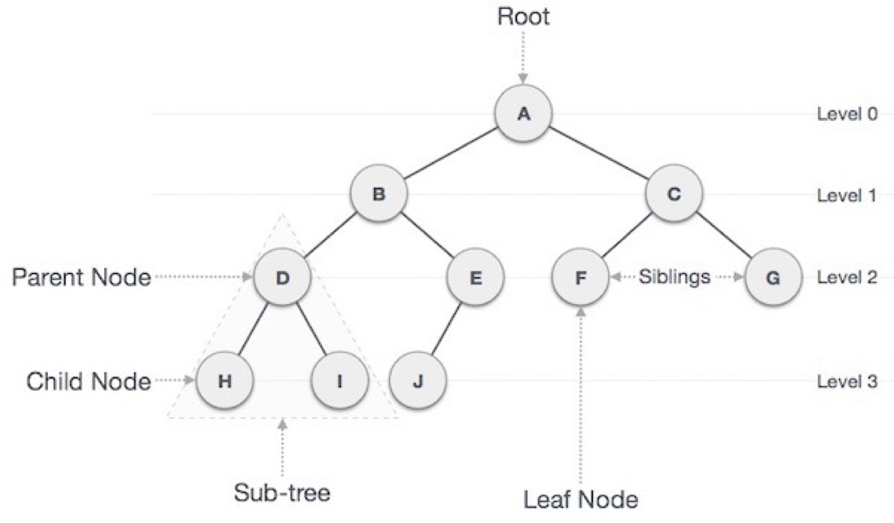

### 트리의 구성

- 루트 노드 - 가장 위에 있는 노드
- 내부 노드 - 루트 노드와 내부 노드 사이에 있는 노드
- 리프 노드 - 자식 노드가 없는 노드

### 이진 트리

: 자식의 노드 수가 두 개 이하인 트리

- 정이진 트리(full)
- 완전 이진 트리(complete)
- 변질 이진 트리(degenerate)
- 포화 이진 트리(perfect)
- 균형 이진 트리(balanced)

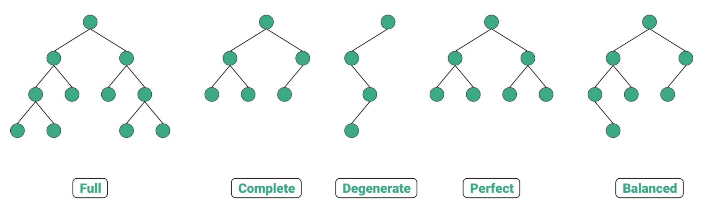

### 이진 탐색 트리

: 노드의 오른쪽 하위 트리에는 ‘노드 값보다 큰 값’ 이 있는 노드만 포함,

왼쪽 하위 트리에는 ‘노드 값보다 작은 값’이 들어 있는 트리

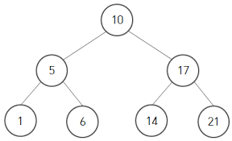

평균 O(logn), 최악 O(n) → 선형적일 경우

### AVL 트리(Adelson-Velsky and Landis tree)

최악의 경우 선형적인 트리가 되는 것을 방지하고 스스로 균형을 잡는 이진 탐색 트리

→ 두 자식 서브트리의 높이는 항상 최대 1만큼 차이 남

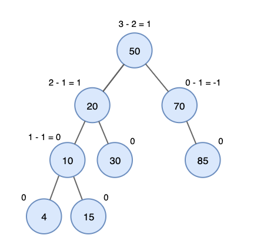

### 레드 블랙 트리

: 균형 이진 탐색 트리

탐색, 삽입, 삭제 모두 O(logn)

각 노드는 빨간색 또는 검은색의 색상을 나타내는 추가 비트를 정하며, 삽입 삭제 중 트리가 균형을 유지하도록 하는데 사용

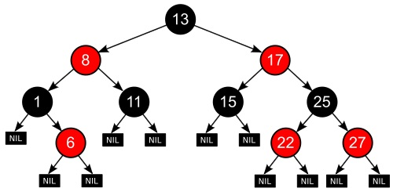

→ “모든 리프 노드와 루트 노드는 블랙이고 어떤 노드가 레드이면 그 노드의 자식은 반드시 블랙이다”

## 힙

: 완전 이진 트리 기반의 자료 구조

- 최대힙 - 루트 노드에 있는 키는 모든 자식에 있는 키 중에서 가장 커야함
- 최소힙 - 루트 노드에 있는 키는 모든 자식에 있는 키 중에서 최솟값이어야 함

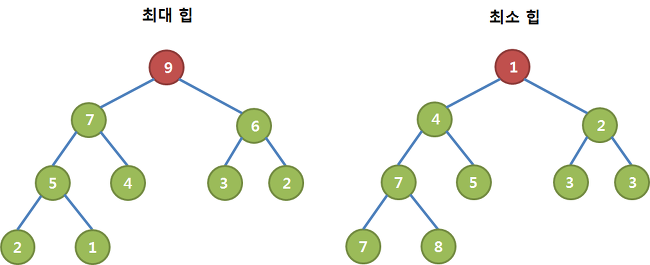

### 최대힙 삽입

힙에 새로운 요소 → 새로운 노드를 힙의 마지막 노드에 이어서 삽입 → 새로운 노드르르 부모 노드들과 크기를 비교하며 교환 → 힙의 성질 만족

### 최대힙 삭제

최대힙에서 최댓값은 루트 노드이므로 루트 노드가 삭제

이후 마지막 노드와 루트 노드를 스왑하여 재구성

## 우선순위 큐

: 우선순위 대기열

대기열에서 높은 요소가 우선순위가 낮은 요소보다 먼저 제공

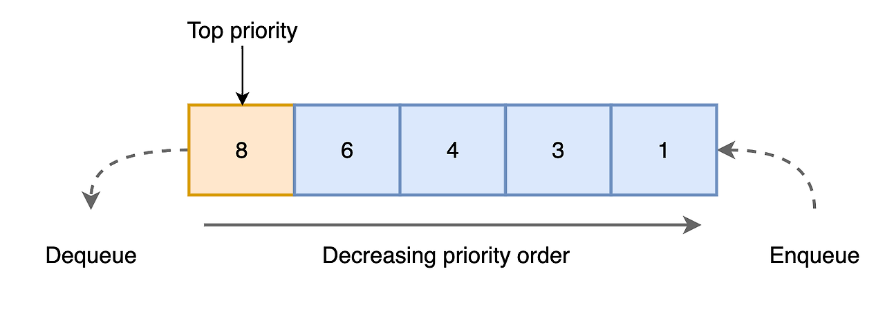

### 맵

특정 순서에 따라 키와 매핑된 값의 조합으로 형성된 자료 구조

레드 블랙 트리 자료 구조를 기반으로 형성, 삽입하면 자동으로 정렬

해시 테이블을 구현할 때 사용

unordered_map, map

```jsx
const myMap = new Map();
myMap.set("name", "Jason");
myMap.set("age", 27);
```

### 셋

특정 순서에 따라 고유한 요소를 저장하는 컨테이너

중복 x, 오로지 유니크 값만 저장

```jsx
const mySet = new Set();
mySet.add(1);
mySet.add(2);
mySet.add(3);

console.log(mySet); // Set { 1, 2, 3 }
console.log(mySet.size); // 3
```

### 해시 테이블

무한에 가까운 데이터들을 유한한 개수의 해시 값으로 매핑한 테이블

삽입, 삭제, 탐색 시 평균 O(1)

unordered_map 으로 구현
